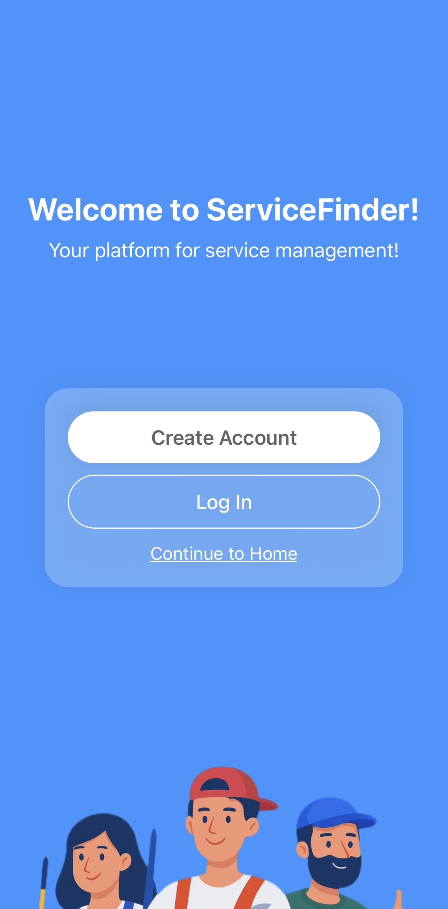

# ServiceFinder

**ServiceFinder** is a mobile application built with **React Native**, designed to help users find and book various home and professional services such as **cleaning**, **plumbing**, **electrical work**, **painting**, and **car towing**.  
The goal of this project is to make it easier for people to quickly find and book trusted service providers anytime they need — at different price ranges and categories.

---

## Project Overview

ServiceFinder provides a simple and efficient way for users to:

- **Browse available services** by category and filters (price, rating, distance).
- **Book a service** for a specific date or time.
- **Chat** directly with service providers.
- **Post your own service** if you want to offer something (e.g. cleaning, plumbing, etc.).
- **Manage your personal profile** including name, contact info, and image.

Currently, the project is in its **first phase**, which includes only the **UI (User Interface)**.  
The upcoming phase will implement backend integration and database functionalities.

---

## Key Features

- **Home Screen** – shows top services, categories, and promotional offers
- **Browse Screen** – search and filter services by type and price
- **Post Screen** – form to post a new service (name, price, discount, rating, category, image)
- **Messages Screen** – chat interface between customers and providers
- **Profile Screen** – manage user details and account information

---

## Tech Stack

| Component            | Technology             |
| -------------------- | ---------------------- |
| Frontend             | **React Native**       |
| Framework            | **Expo**               |
| Programming Language | **JavaScript (ES6)**   |
| Local Data Storage   | **AsyncStorage**       |
| IDE                  | **Visual Studio Code** |
| Version Control      | **Git & GitHub**       |

---

## 📲 UI Preview

### 🔹 Welcome Screen

### 🔹 Home Screen

.png>)
.png>)

### 🔹 Post Service Screen

.png>)
.png>)

### 🔹 Messages Screen

.png>)
.png>)

### 🔹 Browse Services Screen

.png>)
.png>)

## Project Team

**Developed by:**  
**Erik Behrami**, **Elisa Gjurkaj**, **Blertin Hamza**, **Valeza Sutaj**, **Uranit Vuciterna**
