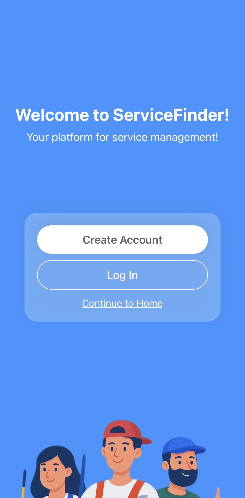
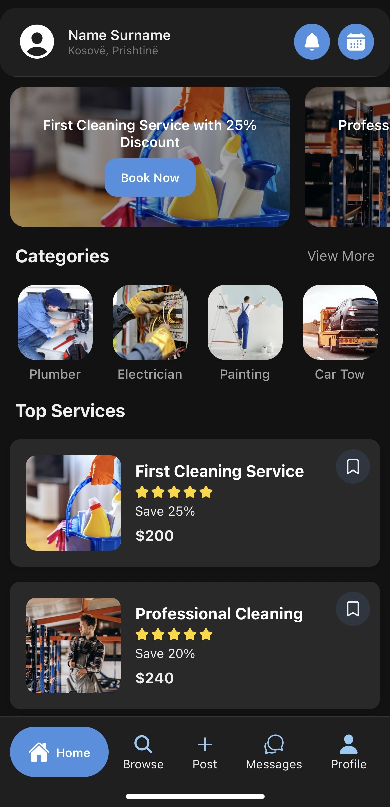
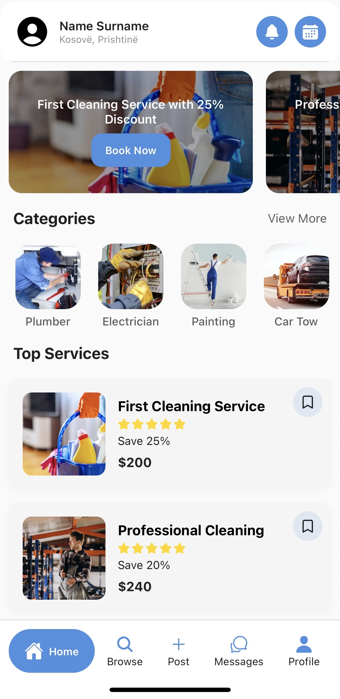
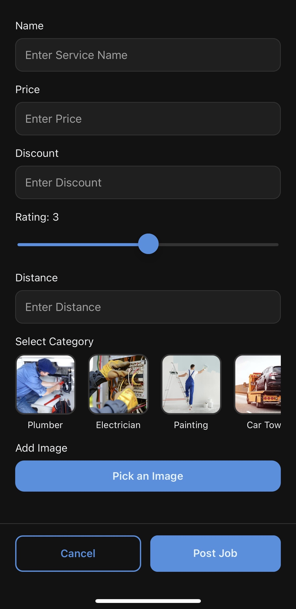
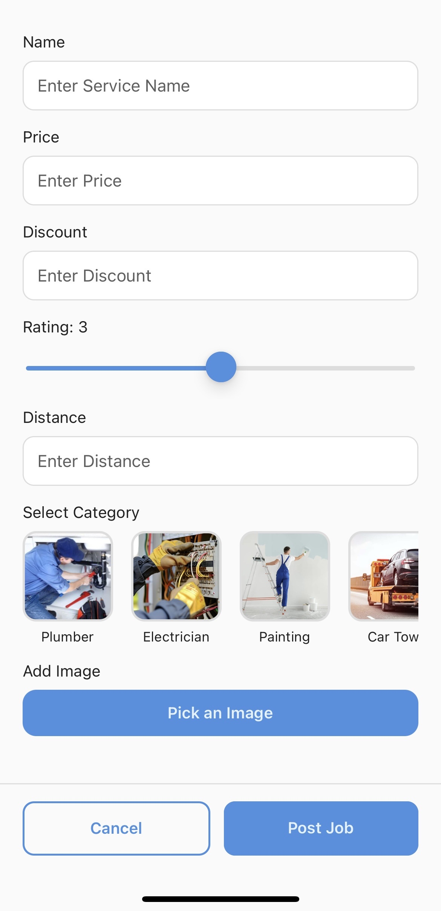
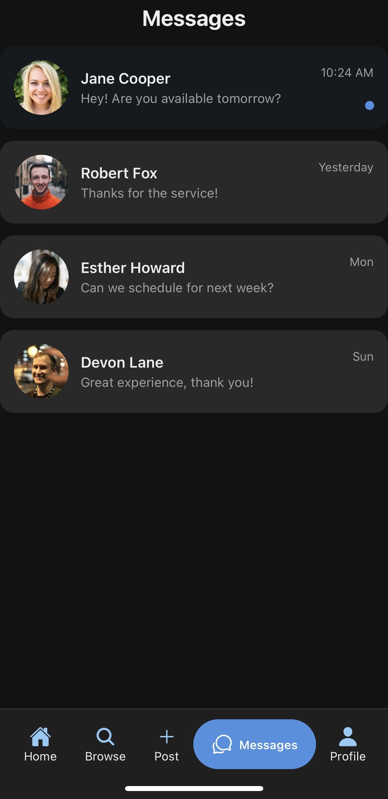
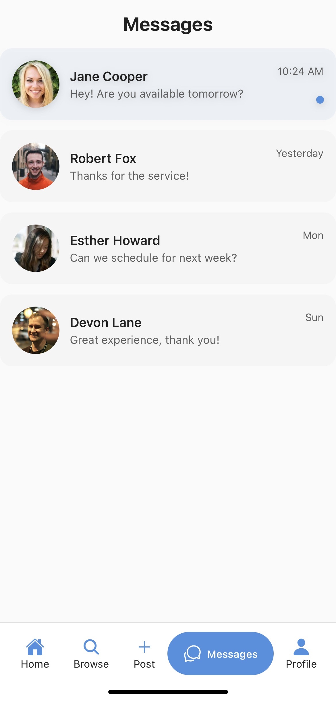
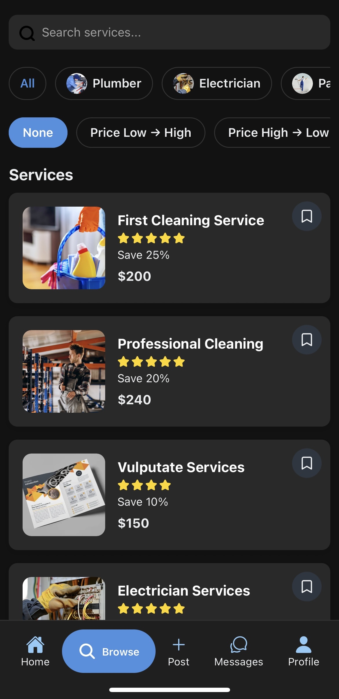
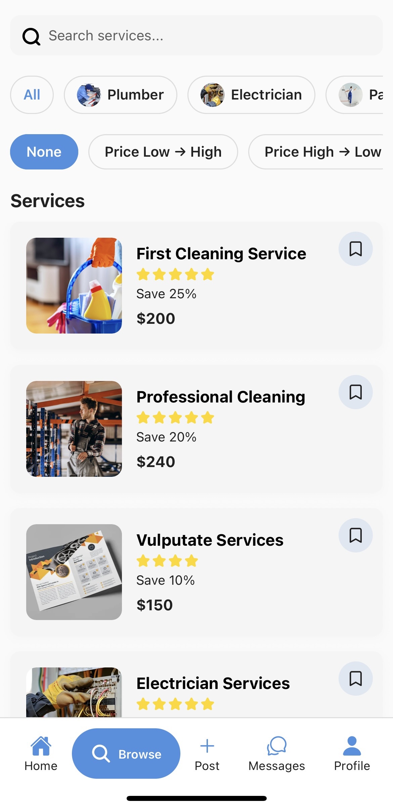

# ServiceFinder

**ServiceFinder** is a mobile application built with **React Native (Expo)** that helps users find, book, and manage home and professional services such as **cleaning**, **plumbing**, **electrical work**, **painting**, **car towing**, and more.

The application connects **customers** with **service providers**, enabling users to request services, manage bookings, communicate in real time, leave reviews, and receive notifications about important updates.

---

## Project Overview

ServiceFinder provides a complete service-booking experience, allowing users to:

- **Browse available services** by category and relevant filters.
- **Create booking requests** for specific dates and times.
- **Accept, decline, cancel, or reschedule bookings** depending on user role.
- **Communicate via real-time chat** with service providers or customers.
- **Leave reviews and ratings** after completed services.
- **Receive notifications** for important events such as booking updates and review actions.
- **Manage personal profiles and privacy settings**, including account security options.

The project has evolved beyond UI-only development and now includes **Firebase backend integration**, **real-time data handling**, and **persistent application state**, making it a functional end-to-end mobile application.

---

## Key Features

- **Home Screen**  
  Displays featured services, categories, and quick access to popular offerings.

- **Browse Services**  
  Search and explore services by category with detailed service information.

- **Service Posting**  
  Providers can post and manage their own services.

- **Booking System**

  - Create booking requests with date and time
  - Accept or decline booking requests
  - Cancel bookings
  - Propose and respond to rescheduling
  - Real-time booking status updates

- **Messaging System**

  - Real-time chat between customers and service providers
  - Online/offline presence tracking

- **Reviews & Ratings**

  - Customers can leave ratings and reviews for services
  - Reviews are stored and displayed per service

- **Notifications**

  - Local in-app notifications
  - Persistent notification history
  - Notifications for:
    - Booking creation
    - Booking acceptance, decline, and cancellation
    - Reschedule proposals
    - Review creation and deletion

- **Profile & Privacy**

  - User profile management
  - Privacy and security settings
  - Password management
  - Account actions (logout, delete account)

- **Dark & Light Mode Support**
  - Fully themed UI using a centralized theming system

---

## Tech Stack

| Component            | Technology                     |
| -------------------- | ------------------------------ |
| Frontend             | **React Native**               |
| Framework            | **Expo**                       |
| Programming Language | **JavaScript (ES6)**           |
| Backend              | **Firebase (Firestore, Auth)** |
| Notifications        | **Expo Notifications**         |
| Real-time Data       | **Firestore Snapshots**        |
| Local Storage        | **AsyncStorage**               |
| IDE                  | **Visual Studio Code**         |
| Version Control      | **Git & GitHub**               |

---

## Installation & Setup

To run this project locally, make sure you have the following installed.

### Prerequisites

- **Node.js** (v16 or higher recommended)
- **npm** (comes with Node.js)
- **Expo Go** app on your mobile device (for testing)

### Steps

1. **Clone the repository**

   ```bash
   git clone https://github.com/valezasutaj/service-finder-mobile-app.git

   ```

2. **Navigate into the project directory**

   ```bash
   cd service-finder-mobile-app
   ```

3. **Install dependencies**
   npm install
4. **Start the Expo development server**
   npx expo start
5. **Run the app**
   Scan the QR code using the Expo Go app (Android / iOS)

## UI Preview

### Welcome Screen



### Home Screen

<p float="left">


</p>

### Post Service Screen

<p float="left">


</p>

### Messages Screen

<p float="left">


</p>

### Browse Services Screen

<p float="left">


</p>

---

## Project Team

**Developed by:**
**Erik Behrami**, **Elisa Gjurkaj**, **Blertin Hamza**, **Valëza Sutaj**, **Uranit Vuçitërna**

```

```
